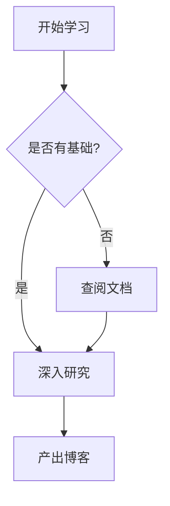

<!--
动态 Draw.io SVG 架构图请使用链接图片语法，避免 Chirpy GLightbox 放大时与 SVG 动画叠加产生闪动：

[](/assets/img/YYYY-MM-DD/diagram.drawio.svg){: target="_blank" rel="noopener" }

点击架构图可在新标签页打开 SVG 原图，并使用浏览器缩放查看。
-->

## 📝 核心内容
<!-- 记录技术点、方案或 AI 学习心得 -->

### 代码块演示
```python
def hello_ai():
    # 右上角会自动出现复制按钮
    print("Hello, AI World!")
```

### 数学公式演示
当 `math: true` 时，可以使用 LaTeX 语法：
$E = mc^2$

$$
\text{Attention}(Q, K, V) = \text{softmax}\left(\frac{QK^T}{\sqrt{d_k}}\right)V
$$

### 流程图演示 (Mermaid)
当 `mermaid: true` 时：


## 💡 个人见解
> 这是一个信息提示框示例。
{: .prompt-info }

> 这是一个需要注意的警告！
{: .prompt-warning }

---
