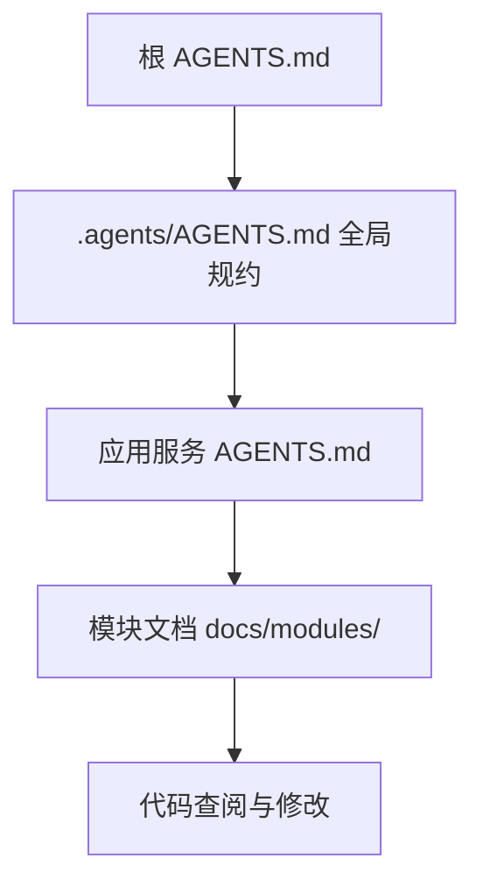
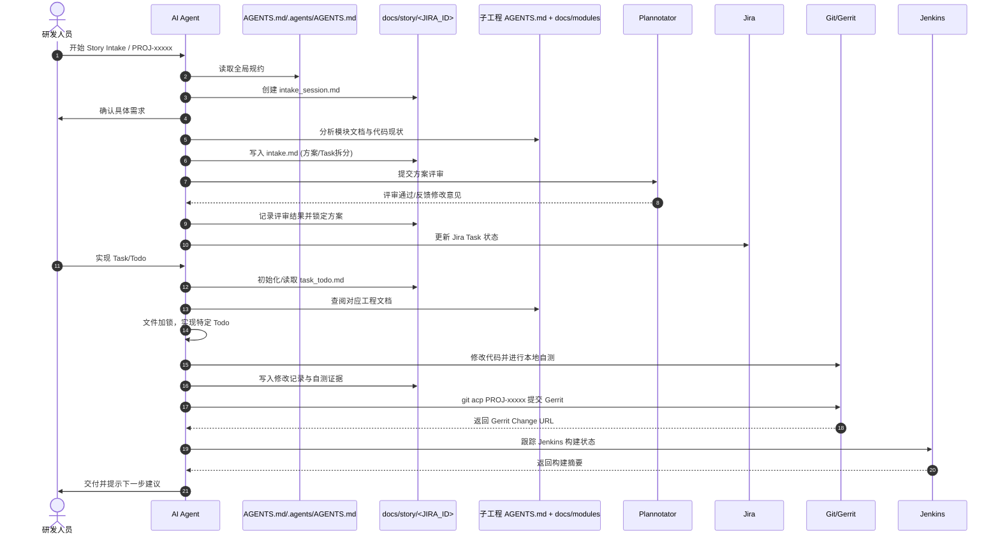
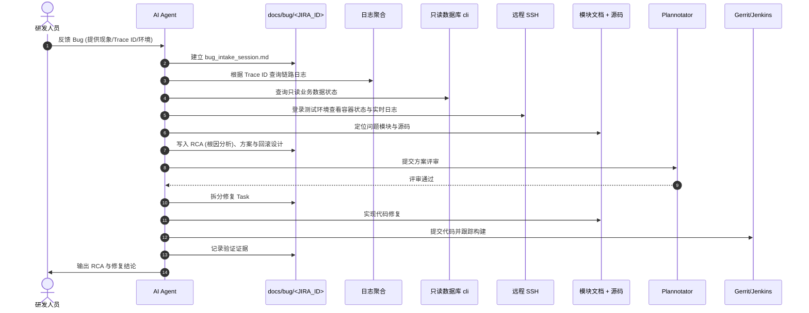
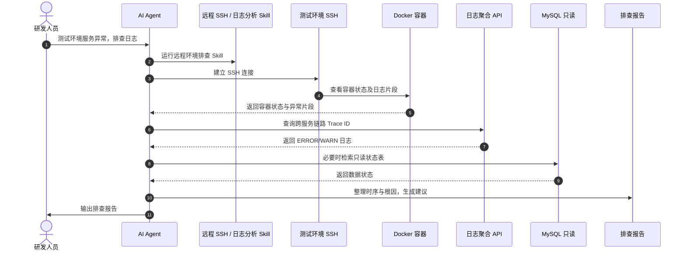

## 1. 定位与价值

小团队 AI Coding 体系是一套面向多仓库、多系统、多环境的研发操作方案：

- 使用 `AGENTS.md` 规范 Agent 的检索顺序与边界。
- 使用 `docs/` 记录需求设计（Story）、问题复现（Bug）、模块描述、环境和验证证据，形成可追溯的研发记忆。
- 使用 `.agents/skills/` 将需求分析、Bug 修复、代码提交、环境排查沉淀为标准操作规程（SOP）。
- 使用 `.agents/aurora_tool/` 提供包括 Jira、Gerrit、Jenkins、数据库和 SSH 在内的命令行工具链。
- 通过 Plannotator、Gerrit 与 Jenkins 将 AI 输出纳入代码评审与交付质量门禁。

该体系的核心价值在于：
1. **降低多仓库认知成本**：通过规范的引导文件和模块文档，避免 Agent 盲目检索代码。
2. **规范研发过程**：要求需求方案、开发任务和验证证据均落盘，便于后期复盘与交接。
3. **建立 AI 质量门禁**：配合评审与构建工具，确保 AI 生成的代码可审查、可验证。
4. **安全连接真实环境**：通过只读数据库查询、受限 SSH 和日志聚合，降低远程环境误操作风险。
5. **流程沉淀与复用**：通过 Skill 机制将开发经验转化为团队共享的 SOP。

---

## 2. 总体架构

体系的设计原则是：**入口定位，文档说明，流程执行，工具落地，证据回写。**



1. **入口引导**：代码仓库根目录的 `AGENTS.md` 负责将 Agent 引导至团队级总规约 `.agents/AGENTS.md`。
2. **多端串联**：Agent 遵循规则先查看前端模块文档与代码，通过 API 路由定位后端工程，再查阅对应的后端模块文档，最后走查代码细节。
3. **Intake（需求分析与设计）阶段**：
   - 启动对应分析 Skill（如 Story/Bug Intake），拉取 Jira 描述，结合本地文档定位功能现状。
   - 自动生成技术方案与 Task 拆分（生成 Intake 文档）。
   - 调用 Plannotator 工具，在网页端由研发人员对技术方案进行评审（包括评论、修改、Approve 等）。
   - 评审通过后，Intake 流程结束，准备进入实现阶段。
4. **Implement（实现）阶段**：
   - 基于 Intake 方案拆分出 `todo.md`。
   - Agent 根据 Todo 顺序修改代码。对多工程修改时，通过文件锁（FileLock）防止并发修改冲突。
   - 提交前，生成本次改动的 Review 引导文档。
   - 通过 Plannotator 进行代码评审。评审通过后，使用 `git acp` 工具进行提交。在此过程中，会调用大模型自动生成改动摘要并追加到 Commit Message。
5. **Validate（验证）阶段**：
   - 利用自动化测试框架编写或修改测试用例并执行。
   - 若测试失败，自动提取 Trace 日志、截屏或录像，分析原因并生成修复建议，反馈给开发人员。

---

## 3. 标准研发过程时序

### 3.1 需求设计到交付 (Story)



### 3.2 Bug 定位与修复



### 3.3 环境排查与日志追踪



---

## 4. 目录结构与职责划分

### 4.1 根目录结构

| 路径 | 职责 |
| --- | --- |
| `AGENTS.md` | 根目录引导入口，声明 `docs/` 为交付记录目录，要求 Agent 继续读取 `.agents/AGENTS.md`。 |
| `.agents/AGENTS.md` | 团队级总规约，定义阅读顺序、导航策略、SOP 路由和提交流程。 |
| `.agents/README.md` | 工具安装与环境变量配置说明。 |
| `.agents/install.sh` | 工具链一键安装脚本（配置客户端 CLI、评审工具及 Git Hook）。 |
| `.agents/skills/` | 团队共享的 Skill (SOP)，描述不同任务的标准操作步骤。 |
| `.agents/aurora_tool/` | 内部客户端工具源码（Jira/Gerrit/MySQL/SSH 命令行封装）。 |
| `docs/` | 独立 Git 仓库，存放需求、Bug 分析文档及环境清单。 |
| `src/` | 业务工程源码。 |

### 4.2 `.agents/` 目录细分

```text
.agents/
├── AGENTS.md                 # 团队总入口
├── README.md                 # 安装与环境配置说明
├── install.sh                # 一键安装脚本
├── hooks/commit-msg          # Gerrit Change-Id 生成 Hook
├── skills/                   # 标准 SOP 库
├── aurora_tool/              # 内部工具源码
├── skill_drafts/             # 处于孵化阶段的 Skill
└── docs/                     # 辅助工具文档
```

---

## 5. 分层导航与文档基建

### 5.1 导航规则

- **阅读顺序**：优先阅读前端模块文档，其次为后端文档，最后是代码。
- **跨仓库跳转**：根据前端调用的 API 前缀，自动路由到对应的后端子模块目录。
- **避免盲目检索**：在进入代码修改前，Agent 必须通读关联的模块说明与接口契约，减少因代码全文检索产生的误判。

### 5.2 交付记录管理

`docs/` 目录采用独立仓库管理，以防开发日志和需求设计文档混入业务源码。

- `docs/00-system/`：系统架构拓扑、模块关系及全局故障排查指南。
- `docs/story/`：按 Jira ID 存放的需求分析（Intake）、实现任务（Todo）与自测证据。
- `docs/bug/`：存放 Bug 的 RCA 分析、临时规避方案、修复步骤及回归测试报告。
- `docs/env/`：记录测试环境配置清单，例如 `mysql-envs.yaml`。

---

## 6. 标准 SOP 库 (Skills)

定义在 `.agents/skills/` 中，供 Agent 运行时加载：

- **分析类**：
  - `aurora-intake-story`：规范需求采访、技术方案设计与 Task 拆分。
  - `aurora-intake-bug`：指引 RCA 分析、日志分析与方案回滚设计。
  - `agent-plannotator-flow`：调用评审工具启动方案或代码的 Peer Review。
- **执行类**：
  - `aurora-implement-task`：处理具体 Todo 开发，控制文件锁并记录自测证据。
  - `aurora-trace-analysis`：基于 Trace ID 查询链路日志并定位异常。
  - `aurora-remote-ssh`：安全建立远程 SSH 连接并获取运行时状态。
- **协作类**：
  - `jira-cli-helper`：简化 Jira 任务状态维护与评论管理。
  - `acp-gerrit-flow`：集成代码提交、自动生成改动摘要与跟踪 Gerrit 状态。

---

## 7. 内部 CLI 工具包

内部工具包（名为 `aurora-devtools`）通过 `.agents/aurora_tool/` 提供以下命令：

- `jira-cli`：Jira Task 的创建、状态扭转与评论交互。
- `gerrit-cli`：Gerrit Change 的查询、Cherry-pick 与构建状态监听。
- `mysql-ro-cli`：只读 MySQL 客户端，支持表结构查询与安全 Explain。
- `aurora-ssh`：远程测试环境的命令执行与实时日志读取。

### `git acp` 提交流程

当研发人员运行 `git acp PROJ-12345` 时，会触发以下本地工作流：
1. 校验 Jira ID 格式是否合规。
2. 自动执行 `git add .`。
3. 调用大模型（如 Gemini 2.5）基于 Staged Diff 生成中文改动摘要。
4. 拼装 Commit Message，写入 `Jira-Id: PROJ-12345` 和 AI 改动总结。
5. 推送至 Gerrit Review 分支（如 `refs/for/<branch>`）。
6. 返回 Gerrit Change 链接，提示研发与评审人员进行后续审核。

---

## 8. 文件树结构示意

```plaintext
aurora_repo/
├── AGENTS.md
│   └── 仓库根 Agent 启动入口；要求继续读取 .agents/AGENTS.md
├── GEMINI.md
│   └── Gemini CLI 启动入口；要求加载 AGENTS.md
├── .agents/
│   ├── AGENTS.md
│   │   └── Aurora AI Coding 总规约：阅读顺序、工程导航、Skill 路由、研发流程
│   ├── README.md
│   │   └── .agents 安装、环境变量、git acp 使用说明
│   ├── install.sh
│   │   └── 安装 aurora_tool、Plannotator、git acp、Gerrit hook、根启动文件
│   ├── hooks/
│   │   └── commit-msg
│   │       └── Gerrit Change-Id hook，保证提交可进入 Gerrit Review
│   ├── skills/
│   │   ├── aurora-intake-story/SKILL.md
│   │   │   └── Story intake：需求采访、方案、Task 拆分、Plannotator Gate
│   │   ├── aurora-intake-feature-bug/SKILL.md
│   │   │   └── Story 的 bug intake：功能实现或自测中产生的 bug 处理
│   │   ├── aurora-feature-env-discovery/SKILL.md
│   │   │   └── 根据 Story Jira ID 获取对应测试环境配置，辅助问题排查
│   │   ├── aurora-intake-bug/SKILL.md
│   │   │   └── Bug intake：复现、日志、RCA、修复方案、回滚设计
│   │   ├── aurora-implement-task/SKILL.md
│   │   │   └── 单个 Todo/Jira Task 编码实现、FileLock、自测、证据回写
│   │   ├── aurora-trace-analysis/SKILL.md
│   │   │   └── Trace ID 全链路日志追踪、异常下钻、RCA 辅助
│   │   ├── aurora-remote-ssh/SKILL.md
│   │   │   └── 测试环境 SSH、Docker、日志、配置检查
│   │   ├── mysql-query-helper/SKILL.md
│   │   │   └── 只读 MySQL schema / query / explain
│   │   ├── jira-cli-helper/SKILL.md
│   │   │   └── Jira Task/Bug 创建、评论、指派、计划工时
│   │   ├── acp-gerrit-helper/SKILL.md
│   │   │   └── git acp 提交并推送 Gerrit
│   │   ├── jenkins-check/SKILL.md
│   │   │   └── Jenkins 构建跟踪
│   │   ├── agent-plannotator-flow/SKILL.md
│   │   │   └── 主动拉起 Plannotator 审阅计划、文档、diff、PR
│   │   └── frontend-design/SKILL.md
│   │       └── 前端 UI/组件设计 SOP
│   └── aurora_tool/
│       ├── pyproject.toml
│       │   └── 注册 jira-cli / gerrit-cli / env-cli / mysql-ro-cli / aurora-ssh
│       ├── README.md
│       │   └── CLI 安装、配置、命令示例
│       ├── src/aurora_devtools/
│       │   ├── jira_cli.py
│       │   │   └── Jira Task/Bug/Plan/Comment 自动化
│       │   ├── gerrit_cli.py
│       │   │   └── Gerrit change 查询、cherry-pick、wait、Jenkins 联动
│       │   ├── mysql_ro_cli.py
│       │   │   └── 只读 MySQL 查询与表结构检查
│       │   ├── aurora_ssh_cli.py
│       │   │   └── 远程测试环境 SSH 诊断
│       │   ├── env_cli.py
│       │   │   └── 环境平台自动化入口
│       │   ├── config.py
│       │   │   └── 环境变量与本地配置解析
│       │   ├── errors.py
│       │   │   └── 统一错误模型
│       │   └── jsonio.py
│       │       └── 统一 JSON/Markdown 输出
│       └── tests/
│           └── CLI 单元测试，保证工具行为可回归
├── docs/
│   ├── system/
│   │   ├── aurora-ai-coding-system-handbook.md
│   │   │   └── 本手册
│   │   ├── module-quick-reference.md
│   │   │   └── 全局模块快速入口
│   │   ├── module-crosswalk.md
│   │   │   └── 前后端/跨系统模块关系总表
│   │   ├── project-inventory.md
│   │   │   └── 多仓库项目清单
│   │   ├── troubleshooting-guide.md
│   │   │   └── 故障排查指南
│   │   └── end-to-end-test-execution-flow.md
│   │       └── 端到端测试执行链路
│   ├── story/
│   │   ├── _templates/
│   │   │   └── Story intake / implement / validate 模板
│   │   └── <JIRA_ID>/
│   │       ├── <JIRA_ID>_intake_session.md
│   │       ├── <JIRA_ID>_intake.md
│   │       ├── <JIRA_ID>_task_todo.md
│   │       └── validate/
│   │           └── <BATCH>_validate.md
│   ├── bug/
│   │   ├── _templates/
│   │   │   └── Bug intake / RCA / 修复验证模板
│   │   └── <JIRA_ID>/
│   │       ├── <JIRA_ID>_bug_intake.md
│   │       ├── <JIRA_ID>_task_todo.md
│   │       └── validate/
│   └── env/
│       ├── mysql-envs.yaml
│       │   └── 只读 MySQL 环境清单
│       └── ssh-envs.yaml
│           └── SSH 环境清单
├── src/
│   ├── cloud/
│   │   ├── console_frontend/
│   │   │   ├── AGENTS.md
│   │   │   └── docs/modules/
│   │   │       └── 业务前台页面、接口前缀、模块入口
│   │   ├── console_backend/
│   │   │   ├── AGENTS.md
│   │   │   └── docs/modules/
│   │   │       └── 业务后端接口、表、定时任务
│   │   ├── admin_front/
│   │   │   ├── AGENTS.md
│   │   │   └── docs/modules/
│   │   │       └── 管理中心前端模块
│   │   ├── admin_backend/
│   │   │   ├── AGENTS.md
│   │   │   └── docs/modules/
│   │   │       └── 权限与后端基础管理模块
│   │   └── <other-cloud-project>/
│   │       ├── AGENTS.md
│   │       └── docs/
│   │           └── 云端服务运行时与模块文档
```
